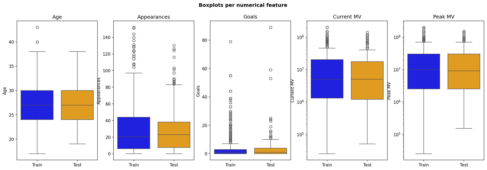
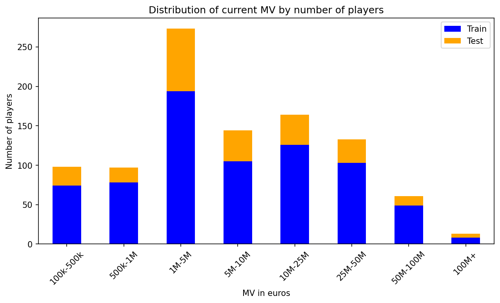
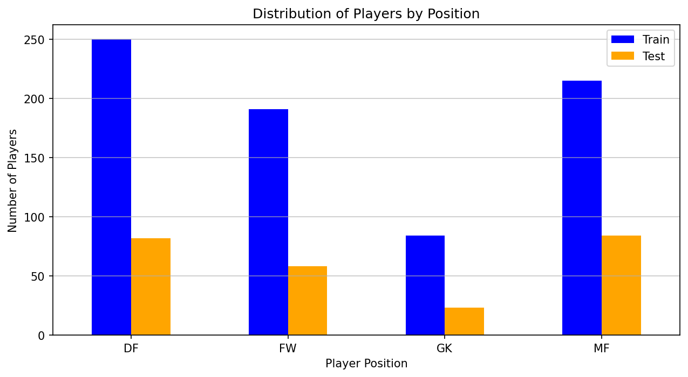
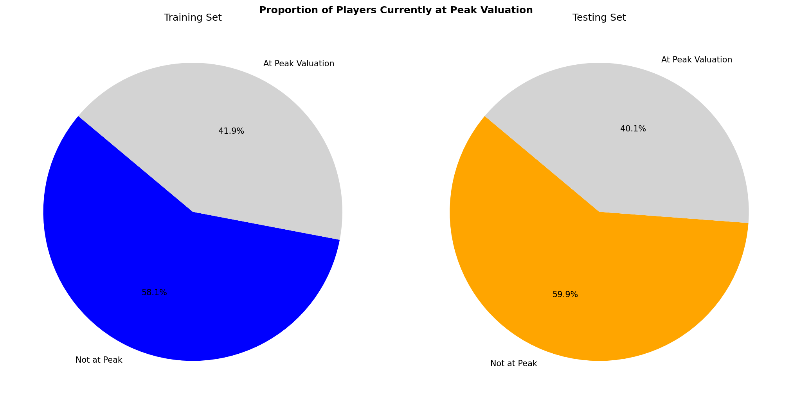
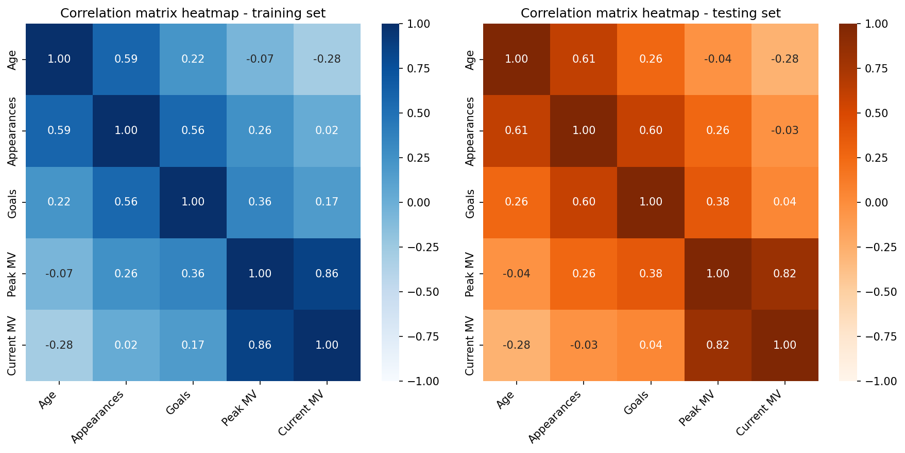
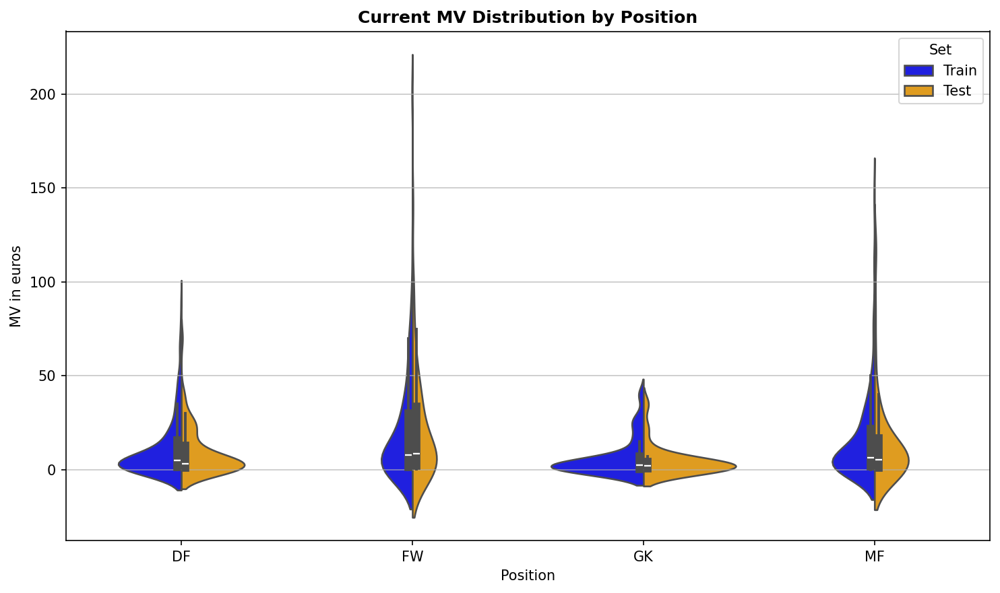
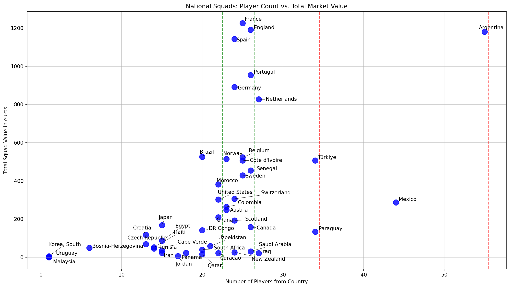
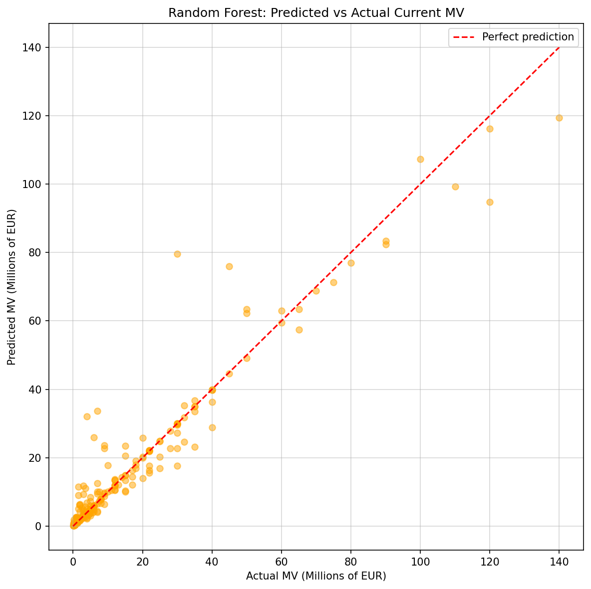

# World Cup 2026 Player Value Prediction

Predicting the current market value of the players in the 2026 FIFA World Cup squads, using a dataset built from Wikipedia and Transfermarkt data.

The full analysis, with explanations for every step, is in [`main.ipynb`](main.ipynb).

## Setup

```bash
python -m venv venv
source venv/bin/activate
pip install -r requirements.txt
jupyter lab
```

All data needed to run the notebook is included or fetched automatically, see [Data snapshot](#data-snapshot) below.

## Data snapshot

The data was extracted in **May 2026**, before the tournament. Both sources are pinned so the notebook reproduces the results below:
* **Wikipedia:** the scrape uses the [page revision from 27 May 2026](https://en.wikipedia.org/w/index.php?title=2026_FIFA_World_Cup_squads&oldid=1356468500).
* **Kaggle / Transfermarkt:** the `players.csv` snapshot downloaded on 25 May 2026 is included in [`data/`](data/). Newer versions of the dataset have different market values.

## 1. Problem type
Regression: the model predicts the current market value of the players who will play at the 2026 World Cup.

## 2. Building the dataset
The data comes from two sources:

**Wikipedia ([2026 FIFA World Cup squads](https://en.wikipedia.org/w/index.php?title=2026_FIFA_World_Cup_squads&oldid=1356468500))**: scraped with `pandas.read_html`. We extract the following columns:
* official appearances a player has made for the national team
* the club they play for
* age
* name
* position

**[Kaggle Player Scores](https://www.kaggle.com/datasets/davidcariboo/player-scores) (Transfermarkt)**: the `players.csv` file, saved in `data/`. We match only the players already extracted from Wikipedia and add for each of them:
* player country
* current market value
* peak market value
* a boolean check for whether a player is in his prime

## 3. Dataset structure
* Train: 740 rows
* Test: 247 rows
* 10 feature columns + 1 target column

| Column      | Type     |
|:------------|:---------|
| Player      | object   |
| Position    | category |
| Age         | int64    |
| Appearances | int64    |
| Goals       | int64    |
| Club        | category |
| Club League | category |
| Country     | category |
| Current MV  | int64    |
| Peak MV     | int64    |
| Apex MV     | bool     |

|     | Player                   | Position   |   Age |   Appearances |   Goals | Club                     | Club League   | Country            |   Current MV |   Peak MV | Apex MV   |
|----:|:-------------------------|:-----------|------:|--------------:|--------:|:-------------------------|:--------------|:-------------------|-------------:|----------:|:----------|
|   0 | Vladimír Coufal          | DF         |    33 |            61 |       2 | TSG Hoffenheim           | L1            | Czech Republic     |      2700000 |  12000000 | False     |
|   1 | David Zima               | DF         |    25 |            24 |       1 | Slavia Prague            | TS1           | Czech Republic     |      7000000 |   7500000 | False     |
|   2 | Jaroslav Zelený          | DF         |    33 |            21 |       0 | Sparta Prague            | TS1           | Czech Republic     |       600000 |   1500000 | False     |
|   3 | David Jurásek            | DF         |    25 |            16 |       1 | Slavia Prague            | TS1           | Czech Republic     |      5000000 |   8000000 | False     |
|   4 | Tomáš Souček             | MF         |    31 |            89 |      17 | West Ham United          | GB1           | Czech Republic     |     12000000 |  45000000 | False     |
|   5 | Vladimír Darida          | MF         |    35 |            78 |       8 | Hradec Králové           | TS1           | Czech Republic     |       375000 |  10000000 | False     |
|   6 | Michal Sadílek           | MF         |    27 |            33 |       1 | Slavia Prague            | TS1           | Czech Republic     |      8000000 |   8000000 | True      |
|   7 | Pavel Bucha              | MF         |    28 |             0 |       0 | FC Cincinnati            | MLS1          | Czech Republic     |      4000000 |   4000000 | True      |
|   8 | Alexandr Sojka           | MF         |    23 |             0 |       0 | Viktoria Plzeň           | TS1           | Czech Republic     |      2300000 |   2300000 | True      |
|   9 | Patrik Schick            | FW         |    30 |            52 |      25 | Bayer Leverkusen         | L1            | Czech Republic     |     20000000 |  50000000 | False     |
...
| 983 | Carlos Harvey            | MF         |    26 |            25 |       2 | Minnesota United FC      | MLS1          | Panama             |       600000 |    600000 | True      |
| 984 | Azarias Londoño          | MF         |    24 |            10 |       0 | Universidad Católica     | Unknown       | Panama             |      1200000 |   1200000 | True      |
| 985 | Ismael Díaz              | FW         |    29 |            54 |      17 | León                     | MEX1          | Panama             |      1800000 |   2000000 | False     |
| 986 | Tomás Rodríguez          | FW         |    27 |            11 |       3 | Saprissa                 | Unknown       | Panama             |      1000000 |   1000000 | True      |

## 4. Saving to CSV
The subsets are saved as `train.csv` and `test.csv`.

## 5. Data cleaning and feature engineering
This combination of World Cup squads and the added features cannot be found anywhere else online. What I did:
* cleaned the age values so they are numbers instead of strings
* kept only the player's name in the `Player` column
* redefined the types of all columns
* normalized the names of countries that no longer exist (for older players)
* added a new column that checks whether a player is in his prime
* filled in missing values for players without a club
* dropped missing values from the remaining columns

## 6. Exploratory data analysis (EDA)

All of my observations about the data are in the notebook, in a markdown cell next to each step.

### 6.a Missing values before handling them
|             |   Number missing |   Percent missing |
|:------------|-----------------:|------------------:|
| Player      |                0 |            0      |
| Position    |                0 |            0      |
| Age         |                0 |            0      |
| Appearances |                0 |            0      |
| Goals       |                0 |            0      |
| Club        |                0 |            0      |
| Club League |              398 |           31.1912 |
| Country     |              273 |           21.395  |
| Current MV  |              289 |           22.6489 |
| Peak MV     |              289 |           22.6489 |

### 6.b Descriptive statistics
Test set data dimension: (247, 10)
Training set data dimension: (740, 10)

Part I: X numerical values, train vs. test

X_train numerical statistics:
|       |       Age |   Appearances |     Goals |         Peak MV |
|:------|----------:|--------------:|----------:|----------------:|
| count | 740       |      740      | 740       |   740           |
| mean  |  26.9878  |       28.5635 |   3.47838 |     2.07927e+07 |
| std   |   4.11389 |       27.9076 |   7.46654 |     2.77643e+07 |
| min   |  17       |        0      |   0       | 25000           |
| 25%   |  24       |        6      |   0       |     2.5e+06     |
| 50%   |  27       |       20.5    |   1       |     1e+07       |
| 75%   |  30       |       44      |   3       |     3e+07       |
| max   |  43       |      152      |  79       |     2e+08       |

X_test numerical statistics:
|       |       Age |   Appearances |     Goals |          Peak MV |
|:------|----------:|--------------:|----------:|-----------------:|
| count | 247       |      247      | 247       |    247           |
| mean  |  27       |       28.3239 |   3.49798 |      2.08099e+07 |
| std   |   4.04949 |       26.3985 |   8.39564 |      2.82257e+07 |
| min   |  19       |        0      |   0       | 150000           |
| 25%   |  24       |        7.5    |   0       |      2.5e+06     |
| 50%   |  27       |       23      |   1       |      9e+06       |
| 75%   |  30       |       38      |   4       |      3e+07       |
| max   |  38       |      130      |  89       |      1.5e+08     |

Part II: X non-numerical values, train vs. test

X_train non-numerical statistics:
|        | Position   | Club           | Club League   | Country   |   Apex MV |
|:-------|:-----------|:---------------|:--------------|:----------|----------:|
| count  | 740        | 740            | 740           | 740       |       740 |
| unique | 4          | 327            | 32            | 45        |         2 |
| top    | DF         | Crystal Palace | GB1           | Argentina |         0 |
| freq   | 250        | 12             | 121           | 43        |       430 |

X_test non-numerical statistics:
|        | Position   | Club     | Club League   | Country   |   Apex MV |
|:-------|:-----------|:---------|:--------------|:----------|----------:|
| count  | 247        | 247      | 247           | 247       |       247 |
| unique | 4          | 173      | 26            | 44        |         2 |
| top    | MF         | Al-Nassr | GB1           | Argentina |         0 |
| freq   | 84         | 5        | 38            | 12        |       148 |

Part III: Y values, train vs. test

y_train statistics:
|       |   Current MV |
|:------|-------------:|
| count |          740 |
| mean  |     14776182 |
| std   |     22642161 |
| min   |        25000 |
| 25%   |      1300000 |
| 50%   |      5000000 |
| 75%   |     20000000 |
| max   |    200000000 |

y_test statistics:
|       |   Current MV |
|:------|-------------:|
| count |          247 |
| mean  |     14037753 |
| std   |     22503640 |
| min   |        50000 |
| 25%   |      1200000 |
| 50%   |      5000000 |
| 75%   |     17500000 |
| max   |    140000000 |

### 6.c Distribution of the variables





### 6.d Outlier detection


### 6.e Correlation analysis


### 6.f Relationships with the target variable



### 6.g Comments and interpretation
Every cell in the notebook has a detailed markdown explanation, more detailed than this README, plus comments in the code.

## 7. Model training and evaluation

**Preprocessing:** one-hot encoding for Position, Club, Club League and Country. The model cannot work with objects/strings the way we read them, so their values are turned into numbers it can work with much more easily. The other columns are already numeric, so they need no changes.

**Model:** `RandomForestRegressor` (`n_estimators=200`, `random_state=42`). I chose this model because, compared to simple linear regression, it handles outliers very well (such as our 200M player).

**Test set results:**
```
RMSE: 6,086,166 EUR
MAE:  2,503,894 EUR
R²:   0.9266
```

**Interpretation:**
* R² shows that the model explains about 92% of the variance in player market values, which is a good enough result for our dataset.
* MAE means that, on average, the prediction is off by 2.5 million euros from the real value.
* RMSE shows that very valuable players, who count as outliers, have their price underestimated. This happens because most of our players are valued between 0 and 25M euros.
* The most important predictor was Peak MV, because player values tend not to deviate much from their highest recorded value.


